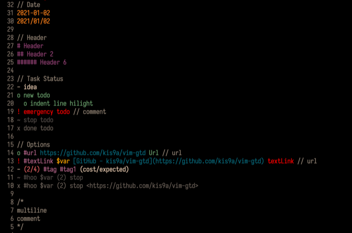

**vim-gtd**

**Image**



**Example text**

```
// Date
2021-01-02
2021/01/02

// Header
# Header
## Header 2
###### Header 6

// Task Status
- idea
o new todo
  o indent line hilight
! emergency todo // comment
~ stop todo
x done todo

// Options
o #url https://github.com/kis9a/vim-gtd Url // url
! #textLink $var [GitHub - kis9a/vim-gtd](https://github.com/kis9a/vim-gtd) textLink // url
- (2/4) #tag #tag1 (cost/expected)
~ #hoo $var (2) stop
x #hoo $var (2) stop <https://github.com/kis9a/vim-gtd>

/*
multiline
comment
*/
```
